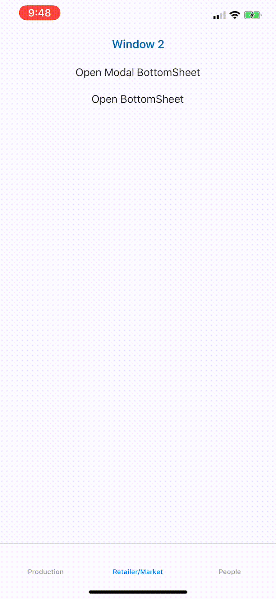

# ti.bottomsheet.fragment
#### Ti Alloy "Fragment" to recreate an iOS BottomSheet
This iteration is a standalone Alloy Controller/View/Style.
  
  

  
1. Copy the .xml/.js/.tss files to your project  
  
2. Edit the .xml & .js as necessary to customize for your app  
  
3. From your app, simply open the Alloy Controller

```javascript
  Alloy.createController("modalBottomsheet", {level: 1}).getView().open();
```

#### To Do:
- [ ] Needs work to better handle events - touchMove, touchEnd, scroll, etc..  
- [ ] Move this to an Alloy Widget and allow user to pass in their Views
